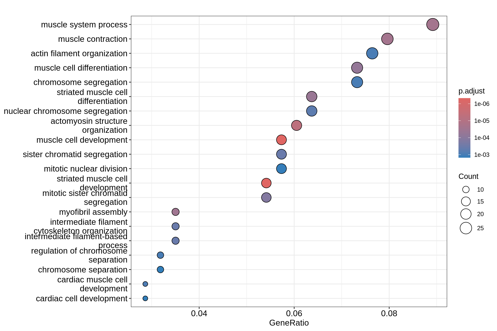
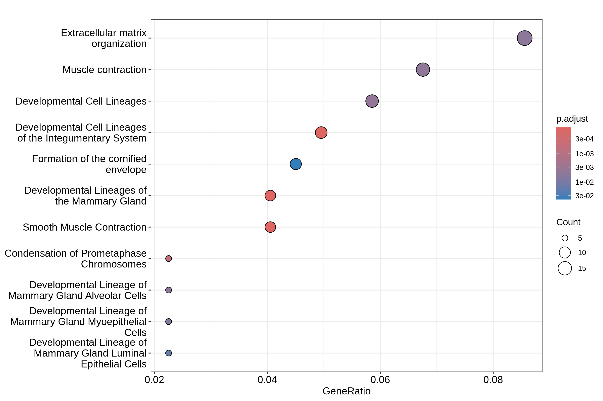
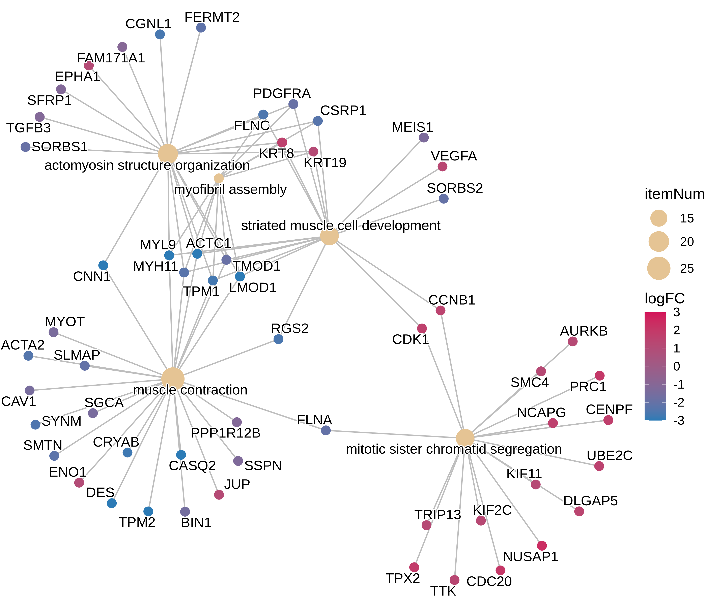
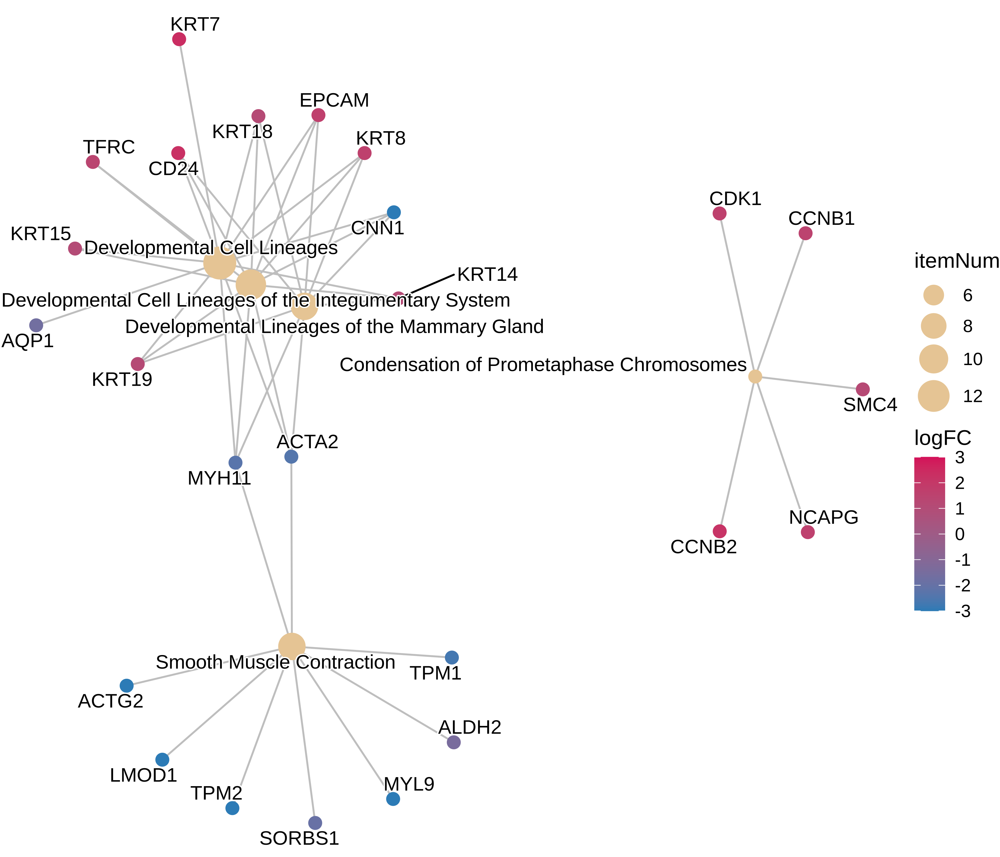

# Meta-análise transcriptômica integrativa para descoberta de biomarcadores diagnósticos em câncer de bexiga

---

## Visão Geral

Este projeto executa uma meta-análise transcriptômica integrativa de diferentes datasets obtidos da base Gene Expression Omnibus (GEO) (GEO) do NCBI.
Este pipeline inclui:
- Meta-análise de expressão diferencial com integração de diferentes datasets.
- Análise de enriquecimento funcional de genes diferencialmente expressos.
- Análise de rede de interação proteína-proteína.
- Validação externa por análise diferencial através da base de dados Recount3 (TCGA + GTex).
- Avaliação de biomarcadores por ROC/AUC.
- Priorização de biomarcadores multi-criterial.

## Objetivo biológico

O objetivo deste projeto é identificar biomarcadores transcriptômicos gênicos robustos associados ao câncer de bexiga através da integração de múltiplos datasets independentes.

## Limitações

- Diferenças entre plataformas transcriptômicas podem introduzir viés residual
- O estudo utiliza dados retrospectivos públicos
- A validação experimental ainda é necessária
- A análise ROC/AUC foi realizada em coortes públicas

---

## Pipeline de análise

1. Coleta de datasets GEO.
2. Processamento, normalização e análise diferencial individual de cada dataset

| Dataset  | Plataforma | Normalização | Anotação |
|----------|------------|--------------|----------|
| GSE7476  | GPL570     | RMA (affy)   | hgu133plus2.db |
| GSE76211 | GPL17586   | RMA (oligo)  | hta20transcriptcluster.db |
| GSE3167  | GPL96      | RMA (affy)   | hgu133a.db |
| GSE65635 | GPL14951   | neqc (limma) | illuminaHumanv4.db |
| GSE37817 | GPL6102    | já normalizado | illuminaHumanv2.db |
| GSE13507 | GPL6102    | normalizeBetweenArrays (limma) | anotação interna |
| GSE52519 | GPL6884    | neqc (limma) | anotação interna |

3. Integração e aplicação de meta-análise de efeitos aleatórios entre estudos
   * A meta-análise foi escolhida como estratégia principal de integração devido à heterogeneidade entre plataformas transcriptômicas e protocolos experimentais, permitindo combinar evidências estatísticas preservando efeitos específicos de cada estudo.
   * Estimativa combinada de:
     * logFC
     * erro padrão
     * significância estatística
     * heterogeneidade entre estudos (I² e tau²)

4. Análise de enriquecimento funcional
   - GO
   - KEGG
   - Reactome

5. Construção de rede de interação proteína-proteína (STRINGdb)
   * Objetivos
     * identificar hub genes
     * avaliar conectividade funcional
     * detectar genes potencialmente centrais em processos tumorais

6. Avaliação de consistência de genes entre datasets individuais
   * Objetivos
     * identificar se o gene é significativo dentro de cada dataset
     * Adicionar o critério da presença dos genes entre os datasets
     * avaliar robuistez do gene

7. Validação externa TCGA + GTex (Recount3)
   * Objetivos
     * Validar os genes identificados como candidatos a biomarcadores
     * Aumentar a robustez da seleção de genes

8. Avaliação de diagnóstico ROC/AUC a partir da análise de validação
   * Objetivos
     * Avaliar a capacidade discriminatória dos genes entre amostras tumorais e não-tumorais
     * Priorizar genes com maior potencial diagnóstico

9. Integração e ranqueamento de candidatos a biomarcadores de câncer de bexiga
   - Os genes são submetidos a um sistema de pontuação para determinar os melhores candidatos a biomarcadores
   * Cut-off de genes
     * |logFC| > 1
     * p-value ajustado por FDR < 0,05
     * I² < 50
     
   * Critérios:
     * Magnitude de expressão do gene (logFC)
     * Significância estatística do gene (p-value ajustado por FDR)
     * Magnitude de expressão do gene pela análise de validação (logFC)
     * Significância estatística do gene pela análise de validação (p-value ajustado por FDR)
     * AUC do gene pela análise de validação
     * Consistência de significância e presença de genes entre datasets
     * Heterogeneidade do gene (I²)
     * Grau de interações em rede PPI
     * Concordância de direção de expressão do gene entre descobrimento e validação
     * Direção de expressão do gene (up-regulados priorizados)

---

## Ferramentas de Software utilizadas

- R (4.6.0)
- RStudio (2026.4.0.526)
- Bioconductor (3.23)

## Pacotes R principais

### Aquisição de dados
- GEOquery
- recount3
  
### Processamento e análise diferencial
- affy
- oligo
- limma
- edgeR

### Anotação
- AnnotationDbi
- org.Hs.eg.db
- hgu133plus2.db
- hta20transcriptcluster.db
- hgu133a.db
- illuminaHumanv2.db
- illuminaHumanv4.db

### Meta-análise
- metafor

### Enriquecimento funcional
- clusterProfiler
- ReactomePA
- enrichplot

### Análise de rede PPI
- STRINGdb
- igraph

### Avaliação de desempenho diagnóstico
- pROC

### Manipulação e visualização de dados
- tidyverse (dplyr, tidyr, tibble, ggplot2)

## Reprodutibilidade

Informação de versões completas de pacotes e sessão está disponível através de: 

```r
sessionInfo()
```

R Environment também está disponível

---

## Execução e Reprodutibilidade

### Windows
#### Pré-requisitos
- Certifique-se de ter o [RTools](https://cran.r-project.org/bin/windows/Rtools/) instalado no sistema (necessário para compilação de pacotes de bioinformática no Windows).

Clonar repositório pelo Powershell em diretório de preferência:

```powershell
# suporte de caminhos longos
git config --global core.longpaths true

git clone https://github.com/RioGen-Tecnologia/Projeto_TCC_2026_Guilherme_Miranda.git
cd Projeto_TCC_2026_Guilherme_Miranda
```

Executar R:
```powershell
# substitua "R-4.6.0" pela sua versão atual do R
& "C:\Program Files\R\R-4.6.0\bin\x64\R.exe"
```

Intalar dependências:

```r
renv::restore()
```

Executar programa:

```r
source("scripts/bladder_cancer_meta_analysis.r")
```

---

### Linux

Clonar repositório em diretório de preferência:

```bash
git clone https://github.com/RioGen-Tecnologia/Projeto_TCC_2026_Guilherme_Miranda.git
cd Projeto_TCC_2026_Guilherme_Miranda
```

Iniciar R

```bash
R
```

Instalar dependências:

```r
renv::restore()
```

Executar programa:

```r
source("scripts/bladder_cancer_meta_analysis.r")
```

---

## Resultados principais

Cada dataset foi analisado por expressão diferencial individualmente e os genes identificados foram integrados por meta-análise de efeitos aleatórios, resultando em um universo integrado de 20.145 genes analisados.

Análises de expressão demonstraram um grande número de genes não significativos em proporção com genes significativos, o que era de se esperar visto o grande número de genes analisados.

<p align="center">

</p>

Foram identificados 341 genes diferencialmente expressos, dentro desse grupo 89 apresentaram baixa heterogeneidade entre estudos (I² < 50%), sendo considerados candidatos mais robustos.

Os 341 genes foram enriquecidos nas bases de dados GO, KEGG e REACTOME. A análise KEGG identificou apenas duas vias significativamente enriquecidas, motivo pelo qual os resultados não foram incluídos nas figuras principais.

<table align="center">
  <tr>
    <td align="center">
      <br>
      <em>GO Biological Process Dotplot</em>
    </td>
    <td align="center">
      <br>
      <em>REACTOME Dotplot</em>
    </td>
  </tr>
  <tr>
    <td align="center">
      <br>
      <em>GO Biological Process Cnetplot</em>
    </td>
    <td align="center">
      <br>
      <em>REACTOME Cnetplot</em>
    </td>
  </tr>
</table>

O grupo de 89 genes foi utilizado nas subsequentes análises multi-criteriais para identificação de candidatos a biomarcadores.

Foi empregada a plataforma STRING para estimar o grau de interações a nível de proteína pelos genes como critério de seleção de biomarcadores.

<p align="center">

</p>

Foi realizado uma análise de validação através da plataforma Recount3 de amostras padronizadas por monorail, comparando as expressões de amostras tumorais da base de dados TCGA e amostras não-tumorais da base de dados GTEx.

Foi observado que todos os 89 genes identificados na análise de descobrimento também foram identificados na análise de validação pelo Recount3 e concordavam em direção de expressão.

Sobre os dados de expressão também foi realizada análise ROC para avaliação diagnóstica a qual foi estimado um valor de AUC para cada gene.

A partir da análise multi-criterial já descrita, foi calculado uma pontuação de ranqueamento para cada gene como candidatos a biomarcadores mais viáveis:

| Gene Symbol | LogFC | Adjusted p-value | I² | AUC | Biomarker Score |
|---|---:|---:|---:|---:|---:|
| CKS2 | 1.74 | 0.0094 | 5.02 | 0.987 | 80.11 |
| SHMT2 | 1.19 | 0.0053 | 0.00 | 0.951 | 77.58 |
| GJB2 | 2.46 | 0.0094 | 0.00 | 0.976 | 77.51 |
| LSR | 1.38 | 0.0083 | 17.06 | 0.969 | 76.94 |
| PPP4C | 1.10 | 0.0062 | 0.00 | 0.992 | 74.28 |
| H2AX | 1.17 | 0.0096 | 0.00 | 0.990 | 73.47 |
| TYMS | 1.72 | 0.0096 | 14.39 | 0.980 | 70.30 |
| UBE2T | 1.42 | 0.0159 | 15.60 | 0.999 | 69.16 |
| KRT16 | 1.42 | 0.0149 | 0.00 | 0.929 | 68.71 |
| CKS1B | 1.16 | 0.0087 | 0.00 | 0.978 | 68.61 |

tabela inteira de biomarcadores: [Bladder_cancer_biomarker_rank.csv](results/biomarker_results/Bladder_cancer_biomarker_rank.csv)

## Agradecimentos

Muito obrigado a minha família, amigos, colegas e especialmente a RioGen por todo o apoio durante essa jornada!

<p align="center">
  
  <br>
  <em>RioGen - 15 de abril de 2026</em>
</p>

## Autor

Guilherme Moret Miranda - RioGen Tecnologia
